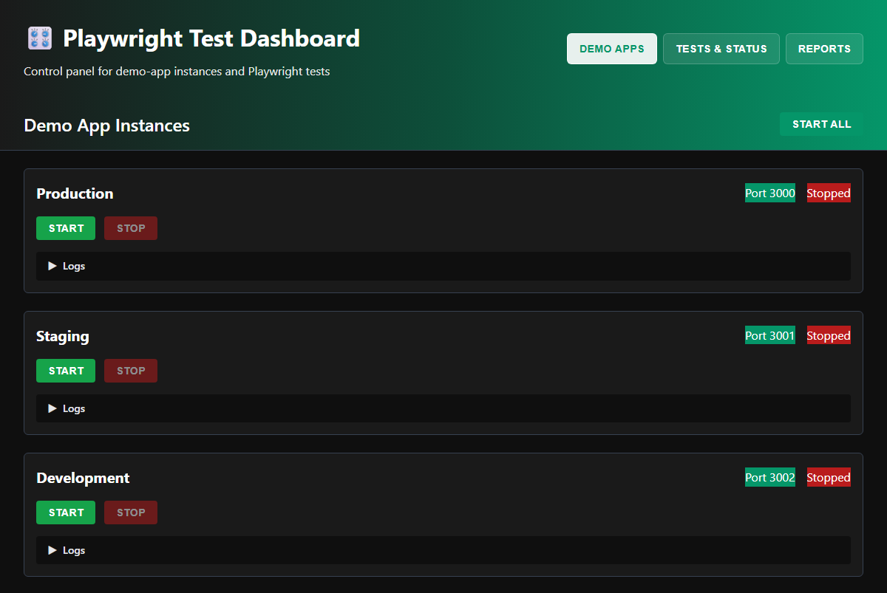
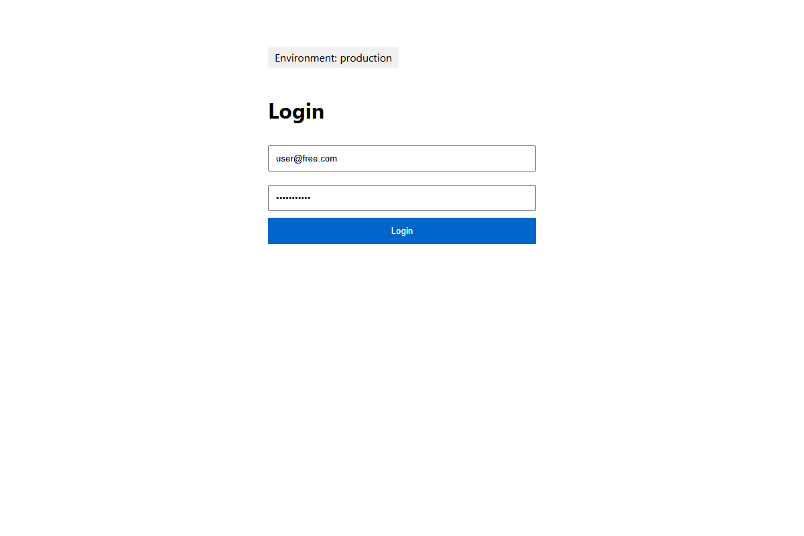

# Playwright Parameterized Testing Framework

Portfolio project showcasing advanced Playwright patterns: dynamic test matrix generation, custom fixtures, and environment-aware POMs.


## Apps 

### Dashboard Control Panel


The web-based control panel provides real-time management of demo-app instances and test execution.

### Demo Application (Production)


The demo System Under Test with user authentication and tier-specific features.

## Monorepo Structure

```
├── e2e/                # Playwright test framework
│   ├── src/           # Test utilities, fixtures, POMs
│   ├── tests/         # Test specs
│   └── playwright.config.ts
├── demo-app/          # Demo System Under Test (SUT)
│   └── src/           # Bun-based web application
├── dashboard/         # Control panel SPA
│   └── src/           # Bun server with HTMX UI
└── package.json       # Workspace configuration
```

## 🎛️ Dashboard

This project includes a web-based control panel for managing demo-app instances and running tests:

```bash
bun run dashboard
```

Then open `http://localhost:4000` in your browser.

**Features:**
- Start/stop demo-app instances for each environment
- View real-time logs from running apps
- Run Playwright tests with live output
- View embedded Playwright HTML reports
- Real-time updates via Server-Sent Events (SSE)

See [dashboard/README.md](dashboard/README.md) for details.


## What It Demonstrates

### 1. Dynamic Test Matrix (36 configurations)

Programmatically generates test projects from combinations of browsers, user tiers, and environments:

```typescript
// e2e/src/getProjects.ts
const browsers = ['chromium', 'firefox', 'webkit', 'Mobile Chrome', 'Mobile Safari', 'Google Chrome'];
const userTiers = ['free', 'paid'];
const environments = ['production', 'staging', 'development'];

// Creates 6 × 2 × 3 = 36 unique test configurations
```

Run specific configuration:
```bash
cd e2e && bunx playwright test --project="chromium-free production"
```

[Full implementation →](e2e/src/getProjects.ts)

### 2. Custom Fixtures with User Provisioning

Extends Playwright with environment-aware fixtures and isolated user contexts:

```typescript
// e2e/src/fixtures.ts
export const buildUserFixture = (userNumber: 1 | 2) =>
  async ({ browser, thisEnvironment, userTier }, use) => {
    const context = await browser.newContext();
    const page = await context.newPage();

    const user = await userManager.create(userTier, thisEnvironment);
    const poms = buildPOMs(page, thisEnvironment, user);

    await use({ user, page, poms });

    await userManager.delete(user);
    await context.close();
  };
```

Each test gets isolated user instances with automatic cleanup.

[Full implementation →](e2e/src/fixtures.ts)

### 3. Environment-Aware Page Objects

POMs use revealing module pattern and adapt to environment configuration:

```typescript
// e2e/src/POMs/loginPage.ts
export const buildLoginPageObject = (page, env, user) => {
  const url = getUrl(env);  // Switches between prod/staging/dev

  return {
    login: async () => {
      await page.goto(url);
      // Login with environment-specific credentials
    },
    assertTier: async (expectedTier) => {
      // Verify user tier in UI
    }
  };
};
```

[Full implementation →](e2e/src/POMs/loginPage.ts)

## Getting Started

Choose one of the following approaches to explore the framework:

### Option 1: Interactive Dashboard Exploration

Use the web-based dashboard to interactively explore and control the testing framework.

#### 1. Install Dependencies

```bash
bun install
```

#### 2. Start the Dashboard

```bash
bun run dashboard
```

Then open `http://localhost:4000` in your browser.

#### 3. Explore the Framework

The dashboard provides:
- **Demo Apps Tab**: Start/stop individual demo app instances for each environment
- **Tests & Status Tab**: Run Playwright tests with live output and project filtering
- **Reports Tab**: View embedded Playwright HTML reports
- **Real-time Updates**: Live logs and status via Server-Sent Events

**Workflow:**
1. Start one or more demo app environments from the Demo Apps tab
2. Switch to Tests & Status tab and run tests
3. Monitor test execution in real-time
4. View detailed reports in the Reports tab

### Option 2: Headless Demo Run

Run a complete automated demo that starts all environments, executes the full test suite, and cleans up.

#### 1. Install Dependencies

```bash
bun install
```

#### 2. Run the Complete Demo

```bash
bun run runDemo
```

This script will:
- Start all three demo app environments (production, staging, development) on ports 3000-3002
- Wait for all apps to be ready
- Execute the complete e2e test suite (36 configurations)
- Display test results
- Automatically clean up all demo app processes

**What it demonstrates:**
- Multi-environment testing across production/staging/development
- Full test matrix execution (6 browsers × 2 user tiers × 3 environments = 36 configs)
- Automated environment management
- Clean teardown and resource cleanup

## Architecture

### E2E Test Framework (`e2e/`)

- **[playwright.config.ts](e2e/playwright.config.ts)** - Matrix configuration entry point
- **[src/getProjects.ts](e2e/src/getProjects.ts)** - Project generation logic (36 configs)
- **[src/fixtures.ts](e2e/src/fixtures.ts)** - Custom fixtures and test extension
- **[src/userManager.ts](e2e/src/userManager.ts)** - User lifecycle management
- **[src/POMs/](e2e/src/POMs/)** - Page object models
- **[src/types.ts](e2e/src/types.ts)** - Type definitions

### Demo Application (`demo-app/`)

- **[src/index.ts](demo-app/src/index.ts)** - Bun web server with multi-env support
- Supports production/staging/development environments
- Pre-configured test users (free/paid tiers)
- Cookie-based authentication

### Dashboard (`dashboard/`)

- **[src/index.ts](dashboard/src/index.ts)** - Bun server with API endpoints
- **[src/processManager.ts](dashboard/src/processManager.ts)** - Demo-app process lifecycle management
- **[src/testRunner.ts](dashboard/src/testRunner.ts)** - Playwright test execution manager
- **[src/public/](dashboard/src/public/)** - HTMX-based SPA with real-time updates

## Key Patterns

✓ Programmatic test configuration
✓ Custom fixture composition
✓ Revealing module POMs _(not ES6 classes)_
✓ Environment-driven test data
✓ Isolated user contexts per test
✓ Monorepo structure with demo SUT

## Test Users

The demo app includes pre-configured users for testing:

- **Free tier**: `user@free.com` / `password123`
- **Paid tier**: `user@paid.com` / `password123`

Access the demo app at:
- Production: `http://localhost:3000`
- Staging: `http://localhost:3001`
- Development: `http://localhost:3002`
