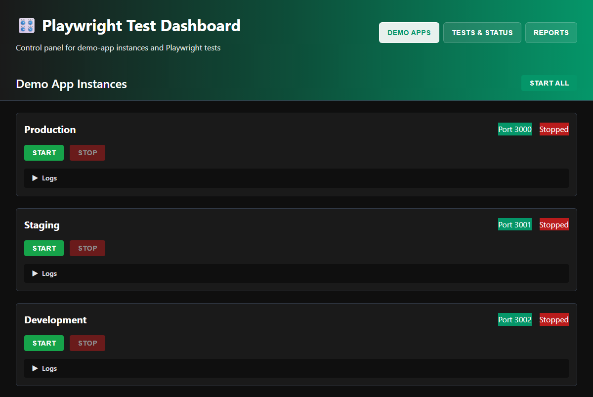
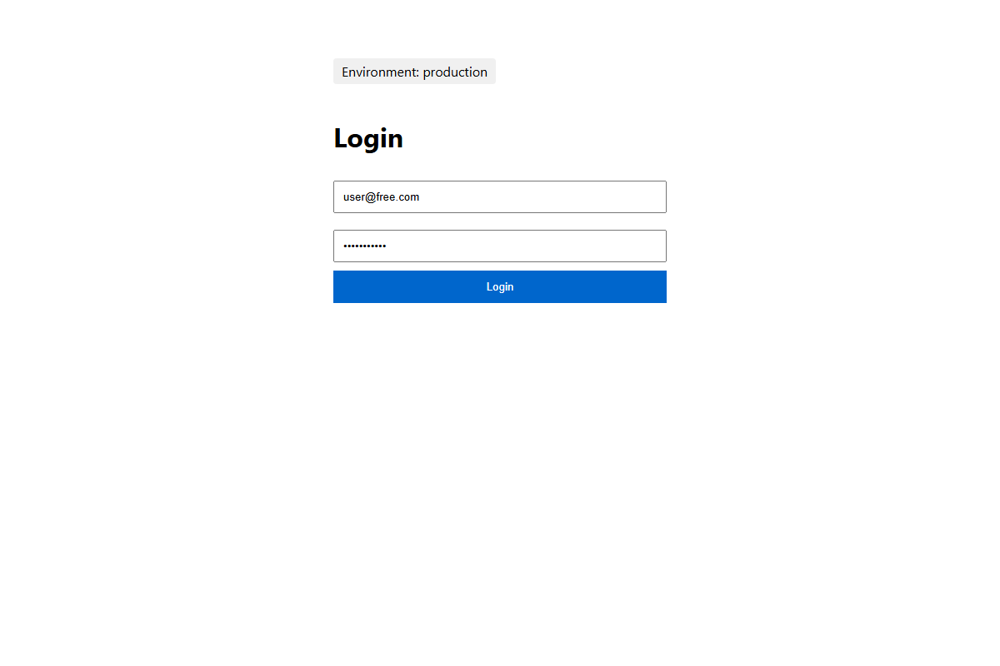

# Playwright Parameterized Testing Framework

[](https://github.com/graffhyrum/playwright-parameterized-user-example/actions/workflows/ci.yml)
[](https://playwright.dev)

Portfolio project showcasing advanced Playwright patterns: dynamic test matrix generation, custom fixtures, and environment-aware Page Object Models.

## Apps 

### Dashboard Control Panel


The web-based control panel provides real-time management of demo-app instances and test execution.

### Demo Application (Production)


The demo System Under Test with user authentication and tier-specific features.

## Why This Project

Test automation suites grow configuration exponentially as teams add browsers, environments, and user tiers. Hardcoding project matrices means every change touches multiple files. This project demonstrates a **programmatic, composable approach** where:

- The test matrix is generated from three axes (browsers × tiers × environments) — adding a new browser is a one-line change
- User provisioning is handled by fixtures with explicit lifecycle hooks — tests are fully isolated
- Page objects adapt to environment without conditional sprawl

See [dashboard/README.md](dashboard/README.md) for dashboard details.  
See [career-ops interview-pack](https://github.com/graffhyrum/career-ops/blob/main/data/projects/playwright-parameterized-user-example-interview-pack.md) for full architectural decisions, trade-offs, and interview angles.

```bash
bun install
bun run test    # starts demo server + runs full test suite
```

## What It Demonstrates

### 1. Dynamic Test Matrix (36 configurations)

Programmatically generates test projects from combinations of browsers, user tiers, and environments:

```typescript
// 6 browsers × 2 tiers × 3 environments = 36 unique test configurations
bunx playwright test --project="chromium-free production"
```

[Full implementation →](src/getProjects.ts)

### 2. Custom Fixtures with User Provisioning

Extends Playwright with environment-aware fixtures and isolated user contexts:

```typescript
// Each test gets isolated user instances with automatic cleanup
export const test = base.extend<Fixtures>({
  user1: async ({ browser, userTier, thisEnvironment }, use) => {
    // create user → use fixture → delete user
  },
});
```


### 3. Environment-Aware Page Objects

POMs use revealing module pattern and adapt to environment configuration:

```

## Architecture

### E2E Test Framework (`e2e/`)

- **[playwright.config.ts](e2e/playwright.config.ts)** - Matrix configuration entry point
- **[src/getProjects.ts](e2e/src/getProjects.ts)** - Project generation logic (36 configs)
- **[src/fixtures.ts](e2e/src/fixtures.ts)** - Custom fixtures and test extension
- **[src/userManager.ts](e2e/src/userManager.ts)** - User lifecycle management
- **[src/POMs/](e2e/src/POMs/)** - Page object models
- **[src/types.ts](e2e/src/types.ts)** - Type definitions

### Demo Application (`demo-app/`)

- **[src/index.ts](demo-app/src/index.ts)** - Bun web server with multi-env support
- Supports production/staging/development environments
- Pre-configured test users (free/paid tiers)
- Cookie-based authentication

### Dashboard (`dashboard/`)

- **[src/index.ts](dashboard/src/index.ts)** - Bun server with API endpoints
- **[src/processManager.ts](dashboard/src/processManager.ts)** - Demo-app process lifecycle management
- **[src/testRunner.ts](dashboard/src/testRunner.ts)** - Playwright test execution manager
- **[src/public/](dashboard/src/public/)** - HTMX-based SPA with real-time updates

## Key Patterns

✓ Programmatic test configuration (36 configs from 3 axes)  
✓ Custom fixture composition  
✓ Revealing module POMs _(not ES6 classes)_  
✓ Environment-driven test data  
✓ Isolated user contexts per test  
✓ Cookie-based auth with explicit lifecycle
✓ Monorepo structure with demo SUT

## Test Users

The demo app includes pre-configured users for testing:

- **Free tier**: `user@free.com` / `password123`
- **Paid tier**: `user@paid.com` / `password123`

Access the demo app at:
- Production: `http://localhost:3000`
- Staging: `http://localhost:3001`
- Development: `http://localhost:3002`
